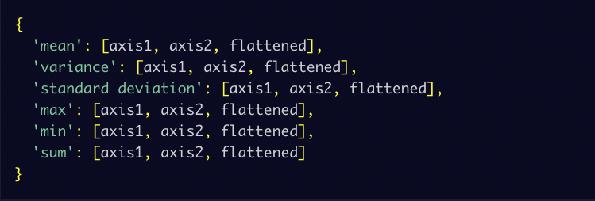
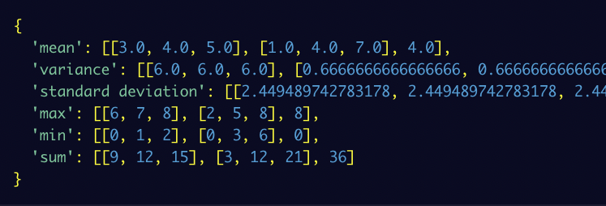

<h1 class="text-center big-heading">Mean-Variance-Standard Deviation Calculator</h1>

Create a function named calculate() in mean_var_std.py that uses Numpy to output the mean, variance, standard deviation, max, min, and sum of the rows, columns, and elements in a 3 x 3 matrix.

The input of the function should be a list containing 9 digits. The function should convert the list into a 3 x 3 Numpy array, and then return a dictionary containing the mean, variance, standard deviation, max, min, and sum along both axes and for the flattened matrix.

The returned dictionary should follow this format:


If a list containing less than 9 elements is passed into the function, it should raise a ValueError exception with the message: "List must contain nine numbers." The values in the returned dictionary should be lists and not Numpy arrays.

For example, calculate([0,1,2,3,4,5,6,7,8]) should return:



The unit tests for this project are in ```test_module.py```.

<h3 class="text-center big-heading">Development</h3>

For development, you can use ```main.py``` to test your calculate() function. Click the "run" button and ```main.py``` will run.

<h3 class="text-center big-heading">Testing</h3>

We imported the tests from ```test_module.py``` to ```main.py``` for your convenience. The tests will run automatically whenever you hit the "run" button.